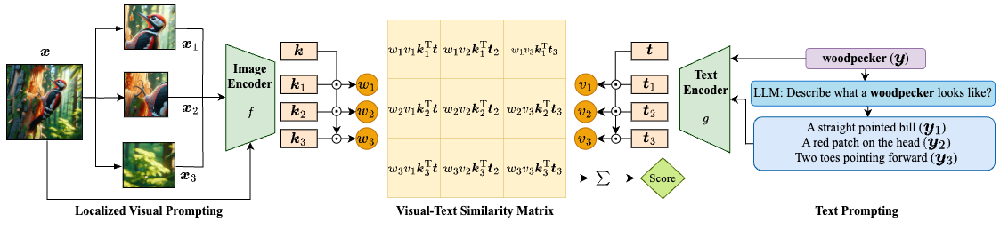
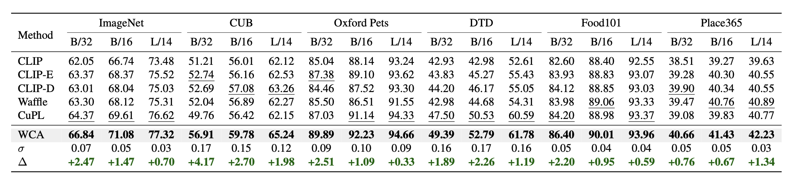
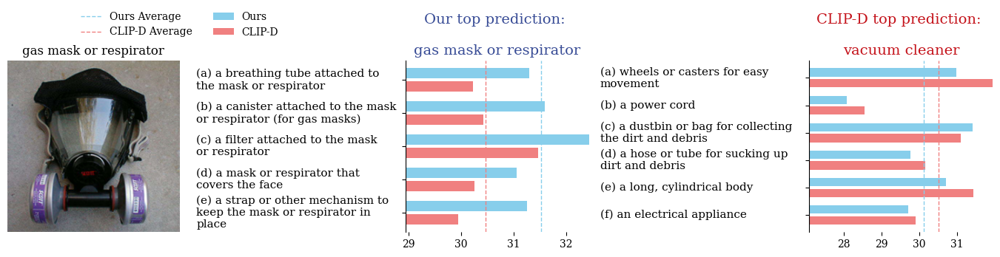

# Visual-Text Cross Alignment: Refining the Similarity Score in Vision-Language Models

Authors: Jinhao Li, Haopeng Li, Sarah M. Erfani, Lei Feng, James Bailey, Feng Liu

[](https://arxiv.org/abs/2406.02915)
[](https://icml.cc/virtual/2024/poster/34359)
[](https://opensource.org/licenses/MIT)

## Introduction
Recent research shows that using a pre-trained vision-language model (VLM), like CLIP, to align a query image with detailed text descriptions generated by LLMs can enhance zero-shot classification. This paper finds that these descriptions align better with local areas of the image rather than the whole. We introduce a method called weighted visual-text cross alignment (WCA) that uses localized visual prompting and a similarity matrix to improve alignment and classification.

## Methodology
**Overview of weighted visual-text cross alignment (WCA)**. The process begins with *localized visual prompting*, where the input image $x$ is divided into localized patches, such as $\{x_1, x_2, x_3\}$. These patches are encoded by an image encoder to produce visual features. The *text prompting* stage utilizes a large language model to generate detailed textual descriptions $\{y_1, y_2, y_3\}$ for a given class label $y$ (e.g., "woodpecker"). The WCA calculates alignment scores between visual features and textual features, using patch weights $\{w_1, w_2, w_3\}$ and text weights $\{v_1, v_2, v_3\}$. The final score is computed by summing the visual-text similarity matrix.



## Experiment Results
**We evaluate the performance of our method on the various datasets and compare it with the state-of-the-art methods**. The results show that our method outperforms the existing methods in zero-shot classification.



## Prediction Explanation 
We demonstrate the prediction and explanation of our methods and CLIP-D, in identifying and explaining a given image of a gas mask or respirator. The image is analyzed to predict its category, with the similarity scores between the image and various descriptions plotted for each method



## Getting Started

These instructions will get you a copy of the project up and running on your local machine for development and testing purposes.

#### Installation

You need to have Python installed on your machine. The project uses `requirements.txt` to manage dependencies. To install the dependencies, you can use a package manager like `conda`:

```bash
conda create --name <env> --file requirements.txt
```

#### Dataset
Please download the dataset and put it in any folder, then specify the `data_path` in the configuration files of `cfgs` folder. Each config file in the `cfgs` folder corresponds to a dataset and its corresponding hyperparameters.

#### Running the Script

The main script of the project is `main.py`. It can be run from the command line using the following command:
```
python main.py --dataset_name imagenet --num_workers 8 --seed 1
```
where `dataset_name` specifies the dataset to be used. The script will run inference on the specified dataset. `num_workers` specifies the number of workers to be used for data loading. `seed` specifies the random seed to be used for reproducibility.

### License

This project is licensed under the MIT License - see the LICENSE.md file for details.

### Acknowledgments

We thank the following papers for their open-source code and models:
- Learning Transferable Visual Models From Natural Language Supervision [[ICML 2021]](https://github.dev/openai/CLIP)  
- Visual Classification via Description from Large Language Models [[ICLR 2023 Oral]](https://github.com/sachit-menon/classify_by_description_release)
- What does a platypus look like? Generating customized prompts for zero-shot image classification [[ICCV 2023]](https://github.com/sarahpratt/CuPL)
- Waffling around for Performance: Visual Classification with Random Words and Broad Concepts [[ICCV 2023]](https://github.com/ExplainableML/WaffleCLIP)

## Citation

If this repository is helpful in your research, please consider citing our paper.
```
@inproceedings{livisual,
  title={Visual-Text Cross Alignment: Refining the Similarity Score in Vision-Language Models},
  author={Li, Jinhao and Li, Haopeng and Erfani, Sarah Monazam and Feng, Lei and Bailey, James and Liu, Feng},
  booktitle={Forty-first International Conference on Machine Learning}
}
```